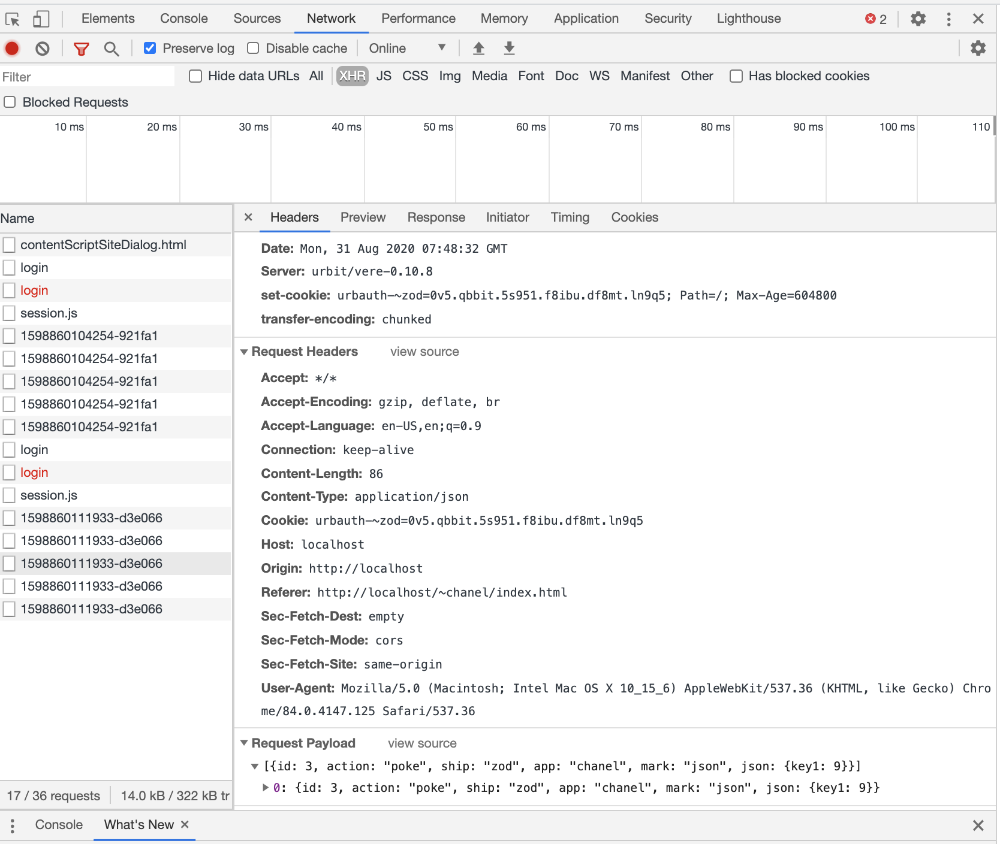
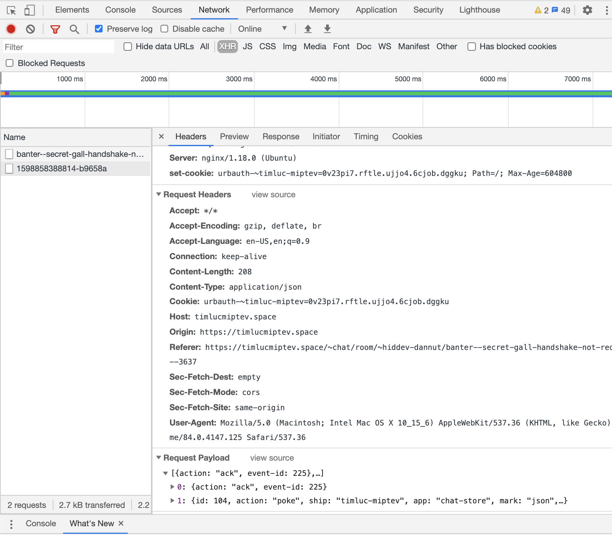

# Call from Outside: JSON & channel.js

In this lesson, we're going to show how to call into your app from the outside world. We'll do it from a web browser, but this example would be easy to extend to other contexts.

In order to make the calls, we'll use and explain the helper library `channel.js`, which is short (235 lines as of this writing) and provides a minimal interface for poking and subscribing.

You'll also learn how to use the `:file-server` Gall agent to serve static files up to web requests from anywhere on your Urbit.

## Example Code
* to `/app/`
  - [chanel.hoon](https://github.com/timlucmiptev/gall-guide/blob/master/example-code/app/chanel.hoon)
* to `/app/chanel/`
  - [index.html](https://github.com/timlucmiptev/gall-guide/tree/master/example-code/app/chanel/index.html)
  - [index.js](https://github.com/timlucmiptev/gall-guide/tree/master/example-code/app/chanel/index.js)
  - [channel.js](https://github.com/timlucmiptev/gall-guide/tree/master/example-code/app/chanel/channel.js)
* to `/mar/chanel/`
  - [action.hoon](https://github.com/timlucmiptev/gall-guide/blob/master/example-code/mar/chanel/action.hoon)
* to `/sur/`
  - [chanel.hoon](https://github.com/timlucmiptev/gall-guide/blob/master/example-code/sur/chanel.hoon)

### to start
Do `|commit %home`, then run `|start %chanel` 

### notes
* uses `%file-server` in `on-init` to statically serve the `app/chanel/` directory from endpoint `/~chanel`.
* `on-poke` uses `|^` to give helper arms inside the `on-poke` rather than using a helper core.
* has `dbug`, so you can type `:chanel +dbug` at any time in the Dojo to see the state

## marks and JSON Parsing

### Action Type and JSON mark
In `sur/chanel.hoon` we define our `action` type. It has 4 different elements, to showcase different ways of parsing JSON.

In `mar/chanel/action.hoon`, we define a `%chanel-action` mark. It has a `json` arm in `grab`, so that we can take `json` sent in with a `%chanel-action` mark by the frontend, and properly parse it here. That parsing works by running `=<  (action jon)` on the incoming JSON, where `action` is an arm that produces a JSON parser (a gate). Let's look now at how that works.

### JSON Parsing, Explained
In order to parse, we use the `dejs:format` core found in `zuse.hoon`. Its arms let us create gates that will parse a given piece of JSON. There are two basic types of arms: arms that directly produce gates (like `so` and `ni`) and arms that require samples to produce gates (like `of` and `ot`)

#### Simple Parsers
These parsers all take json directly and produce various types like numbers and strings.  You can find all variants by searching for `++  dejs` in `sys/zuse.hoon`.
```
> (so:dejs:format (json [%s 'hello']))
'hello'

> (ni:dejs:format (json [%n ~.99]))
99

> (no:dejs:format (json [%n ~.99]))
~.99

> (bo:dejs:format (json [%b %.y]))

%.y
```

#### Parsers with Samples
These expect a sample in order to produce a gate that can then be used to parse.
```
::  parse string using an aura
> `@da`((se:dejs:format %da) (json [%s '~2020.7.4..08.39.17..541e']))
~2020.7.4..08.39.17..541e

> `@p`((se:dejs:format %p) (json [%s '~timluc-miptev']))`
~timluc-miptev

::  parse string using a rule (useful for going from ship-name to @p)
> `@p`((su:dejs:format fed:ag) (json [%s 'timluc-miptev']))
~timluc-miptev
```

#### Object and Array Parsing
Objects:
```
:: set up example maps
> =m1 (~(put by *(map cord json)) ['key1' [%s 'sample cord']])
> =m2 (~(put by *(map cord json)) ['key2' [%n ~.998]])
> =mboth (~(put by m1) ['key2' [%n ~.998]])

::  of takes a list of [key parser] tuples and makes a parser that creates [key value] keys for ONE key
::  first element of the tuple is a possible key
::  second element of the tuple is the parser to use for that type of key
> =of-parser %-  of:dejs:format
  :~  [%key1 so:dejs:format]
      [%key2 ni:dejs:format]
  ==
> (of-parser (json [%o m1]))
[%'key1' 'sample cord']
> (of-parser (json [%o m2]))
[%'key2' 998]

::  ot takes a list of n tuples, but makes a parser that for an object that has ALL the keys
> =ot-parser %-  ot:dejs:format
  :~  [%key1 so:dejs:format]
      [%key2 ni:dejs:format]
  ==
> (ot-parser (json [%o mboth]))
['sample cord' 998]
```

Arrays:
```
::  ar - array as list. List has one type inside, so one parser passed
> ((ar:dejs:format ni:dejs:format) (json [%a p=~[[%n p=~.9] [%n p=~.10]]]))
~[9 10]

::  at - array as tuple (multiple parsers needed)
> ((at:dejs:format ~[ni:dejs:format so:dejs:format]) (json [%a p=~[[%n p=~.9] [%s 'hello there']]]))
[9 'hello there']

::  as - array as set, all of one type
> `(set @ud)`((as:dejs:format ni:dejs:format) (json [%a p=~[[%n p=~.10] [%n p=~.10] [%n p=~.9] [%n p=~.10]]]))
{10 9}
```

## Simplest Possible Browser/Ship Interaction
In our `on-init`, we started serving the `app/chanel` directory publicly, with no login required. This means that you can navigate directly to [http://localhost/~chanel/index.html](http://localhost/~chanel/index.html) and see a page there.

If you open the JS console, you'll see some messages with your current ship name and some stuff about "Successful Poke".

In `index.html`, you'll see that we include `channel.js` and `index.js`. The latter is our custom logic, so let's start by learning about `channel.js`.

## channel.js
`channel.js` is a library that lives under `/~landscape/js/channel.js` when you are logged in to your ship. We'll use the [May 28th version](https://github.com/urbit/urbit/blob/4fded00005770a84a53ff77a81ba71353f84b4bd/pkg/arvo/app/landscape/js/channel.js) in this lesson and serve it directly from `app/chanel/channel.js`.

`channel.js` allows you to do pokes and subscribes to a running ship, similar to what we've seen from the Dojo. The only difference is that the data for the pokes will initially be passed as JSON, which is why we learned about parsing above.

### Interface to channel.js
You create a new channel by calling `new Channel()`. This initializes a data structure to track pokes and subscriptions.

You interface with channel.js by calling `poke`, `subscribe` and `unsubscribe`.

#### poke
`poke(ship, app, mark, json, successFunc, failureFunc)`
* ship: ship name, generally the one our frontend is logged in to
* app: name of the Gall app
* mark: name of the mark
* json: data to pass in the poke. We'll see in a bit how custom marks let us parse it on the Gall side
* successFunc: function to call if poke succeeds; takes no parameters
* failureFunc: function to call if poke fails; takes error as parameter

#### subscribe
`subscribe(ship, app, path, connectionErrFunc, eventFunc, quitFunc)`
* ship: ship name, generally the one our frontend is logged in to
* app: name of the Gall app
* path: `on-watch` path to subscribe to
* connectionErrFunc: function to call if subscribing fails
* eventFunc: function to call on success, takes a json argument, returned from the ship
* quitFunc: function to call after unsubscribing or being kicked

#### unsubscribe
`unsubscribe(subscription)`: passes a subscription from `outStandingSubscriptions` to unsubscribe to.

### Basic Logical Flow
1. `poke` or `subscribe`  is called
2. send their json to `ship/~/channel/$UID`
3. Generate a new `outstandingPoke` or `outstandingSubscription`
4. Open up an `EventSource` if one doesn't exist
5. Poke will generate one response (basically an ack); subscribe will create as many as the server generates. All will be handled in the `onmessage` function.

#### poke Response
If the response is to a poke, its data is disregarded, and we just run the poke `onSuccess` function and delete the `outstandingPoke`. This is like a `%poke-ack` in our [prior lesson](poke.md).

#### subscribe Response
This can receive a `"quit"` response (for `kick` and `leave`) which causes it to call the subscription's `quitFunc` and deletes the `outstandingSubscription`.

If it receives an `"event"` response, it calls the subscription's `eventFunc` with the the `json` element of the return object.

### "Under the Hood"
`channel.js` creates a JS `EventSource`, which is just an object that that opens a connection to a server on a URL, and listens for updates on it from the server. You [attach](https://github.com/urbit/urbit/blob/4fded00005770a84a53ff77a81ba71353f84b4bd/pkg/arvo/app/landscape/js/channel.js#L180) an `onmessage` function to the event source to process messages back.

## index.js
Now we can go through this and see how it interacts with our ship's running Gall app.  For this part of the lesson, uopen up the Console in the developer tools of your browser.

Go to `localhost/~chanel/index.html` (add the port if necessary for your fakezod).

### Logging In
In line 22, we do a POST request to our server with the body as the ship's password. If this succeeds, it sets a cookie in our browser that will automatically be used for future calls to the ship.

### Getting Ship Name
In line 30, we fetch `session.js` and eval its result--this is a file that is available once you are logged in, and it has code to inject the current ship name to `window.ship`.

### Make Pokes
In lines 12-14 we poke the ship 3 times. These pokes run right away when you load `index.html`

#### poke 1: mutate ship state
Here we poke `chanel` with `chanel-action`, and pass JSON data. Our ship receives that, and Gall tries to find a corresponding mark in `mar/chanel/action.hoon`. It does, and now it needs a `grab` arm to go from `json` to `action` (line 7).

We use `of` object parsing to alternate between the 4 different possible JSON keys. In this case, our key matches `%increase-counter`, so the value of the object is parsed with the `counter` arm (line 22).

`counter` returns a parser that parses a tuple with one element, a number.

Run `:chanel +dbug` at the Dojo to see the updated counter state.

#### poke 2: extended JSON parsing
If you look back at the Dojo, you should see a line that was printed out when the pokes were sent:
```
>>  [who=~timluc-miptev msg='hello world' app=%chanel friends={~dopzod ~timluc ~zod}]
```
This was created by our poke in line 13 of `index.js`: we poked again with a `chanel-action` mark type. Our mark in `mar/chanel/action.hoon` matches the `'example'` key in line 19, which calls the `example` arm to process the object in the value slot. This uses `ot` to parse an object with multiple keys, and returns the whole thig as an `action:chanel` type, which is then printed out as you see above.

#### poke 3: raw JSON
We also see in the Dojo:
```
[%o p={[p='key1' q=[%n p=~.9]]}]
```
This is our poke from line 14 of `index.js`; here, we use a raw 'json' mark, and then print the resulting object when it comes into the Dojo.

In general, you want to have marks set up to translate JSON so that you can have a clear set of typed, predictable inputs to your app.

### Subscribe
Line 17 sends a subscription to the ship, which is handled in `on-watch` (line 77 of `app/chanel.hoon`). The path `/example` must exist in order for this to work. Now our frontend is listening to any data that the ship sends out on the `/example` path.

### Send Subscription Data
Let's check that our subscription is working. On the webpage, enter some text in the `"Type message here"` input box, and click the `"Send Data to Subscription"` button.

Line 10 of `app/chanel/index.html` handles the onClick of that button: when pressed it calls `sendSubData` with the current value of the text box, which sends a poke to `%chanel` that then sends data to all subscribers.

You'll see the data get handled in the console with a message that it `"got response: $YOUR_MESSAGE"`.

Great! We now have a clear way for our ship's Gall app to pass us any data about things in the app that have changed. This "frontend-updating" path is, by convention, usually called `/primary`, but as we see here, that name is just a parameter.

## Debugging
You can use Chrome/Brave/Safari developer tools to view the pokes that `channel.js` makes to your ship.  Here are examples, both for this lesson's code, and on a live ship:

### Example 1: `chanel.hoon`


### Example 2: Live Ship (`~timluc-miptev`)


## Summary
* Logging in is a very "non-magical" process that simply involves making a `POST` call that sets a cookie.
* Subscriptions (usually to a path called `/primary`) are the way that Gall apps send data to the frontend.
* Pokes are used to send in actions

You now have seen almost all the basics of Gall, and know how to communicate with your app from the frontend. You could definitely go ahead and write any frontend app you want now, but it's nice to have some better starting point than just raw HTML+JS (although that's a totally valid option!). 

So, in the next section of this course, we're going to learn next about React and Landscape, as well as some patterns you can use to make apps that integrate into the Urbit experience.

[Prev: HTTP & Static Files](http.md) | [Home](overview.md) | 
