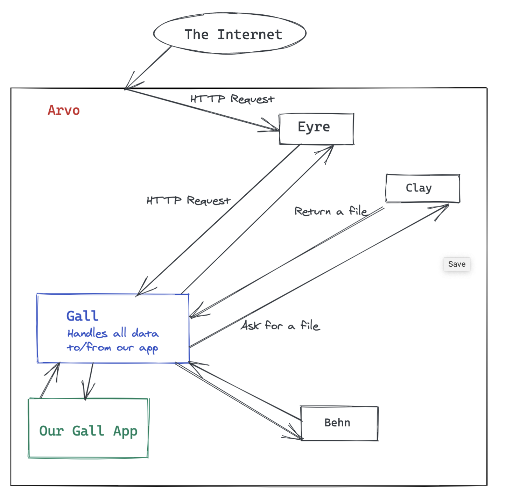

# The Complete Guide to Gall: Overview
This guide will give you a full, working knowledge of every aspect of creating Gall apps in Urbit. Over the course of the guide, we will build up a code review/homework submission app that uses all aspects of Gall and a Landscape frontend.

This guide is for anyone with an intermediate knowledge of Hoon (Hoon School 101 should be enough). To write Gall apps that interact with the frontend, you'll also need some knowledge of Javascript.

## Table of Contents

### Basic Backend
* [Workflow Setup](workflow.md)
* [The 10 Arms of Gaal: App Structure](arms.md)
* [App Lifecycle and State](lifecycle.md)
* [Importing Code and Static Resources](ford.md)
* [Talk to Ships: Poke and Watch](poke.md)
* [Call from Outside: JSON, channel.js and Static Files](chanel.md)
* [Communicating with the Outside World (HTTP)](http.md)

### Basic Frontend
* [Landscape: GUI for Gall](landscape.md)
* [Style](style.md)
* [Walkthrough: Landscape Skeleton]()
* [Communicating with Landscape (Pokes & Subscriptions)]()
* [Everything about React for Landscape]()

### More Backend
* [on-peek & Data Model/Store](model.md) 
* [Store/Hook/View]()
* [Using Existing Data like Groups]()
* [Calling the OS (Arvo)]()

### Appendix
* [Troubleshooting & FAQ](faq.md)
* [Types Used in Gall Apps](appendix_types.md)
* [Common Hoon Idioms Used in Gall]()

## What Is Gall?
Gall is a program (OS kernel or "vane") that runs in the background on Urbit's operating system, Arvo. It manages most of the programs you think of as Urbit's apps. Most Urbit apps know and love, like Chat and Publish, are Gall applications. 

Gall passes all messages going into your app, and processes all messages going out from your app.

### Gall's Responsibilities
* App Registration: Gall listens for commands to register new user applications and start watching them.
* Compilation: Gall re-compiles registered apps whenever their source code changes.
* Upgrades: Gall manages an app's transition from one version to the next, making sure that all old data is imported correctly to the new version.
* Requests between a Gall app and Arvo vanes: Gall provides a layer between all of its registered apps and calls out to the Arvo OS, for operations like HTTP requests/responses and file access.
* Requests between Gall apps themselves: Gall apps on one ship can send each other calls and request data to be processed.
* Requests between Urbit ships: Gall provides interfaces to handle all the messages that happen when ships send messages to each other, or subscribe to resources on each other.

## Gall vs Generators
You probably have written generators when learning Hoon. Generators are awesome! However, they have a different use-case from Gall apps, and it's important to understand when you want each of them.
### Generators
Generators are used to process data. They take in some simple input, like an argument or the current state of your ship, and return a value based on that. They're similar to command-line utilities in Unix.

### Gall
Gall apps are for when you want a longer running service, more like a daemon in aUnix, something that's always running in the background, waiting for messages. Typical use cases:
* HTTP handling
* Work with the OS
* Long-running application on your ship
* Hosting a remote service for other ships

## A Diagram

## What Do I Need to Know?
To write Gall programs, you need a decent understanding of Hoon. To write Gall programs that use Landscape, you need to know Javascript. For the JS part, we'll go over in a lot of detail, so that even if you haven't seen much React, you'll be able to follow along.

## Final Notes
Throughout this guide, I generally use "prose" explanations. When a certain section is very code-heavy (such as breaking down all pieces of a type), I put the whole thing in a code block and use comments (`::`) to explain.

Also, while Gall applications are technically referred to as "agents", I also use the words "app" and "program" at times. All are equivalent.

[Next: Workflow and Environment](workflow.md)
